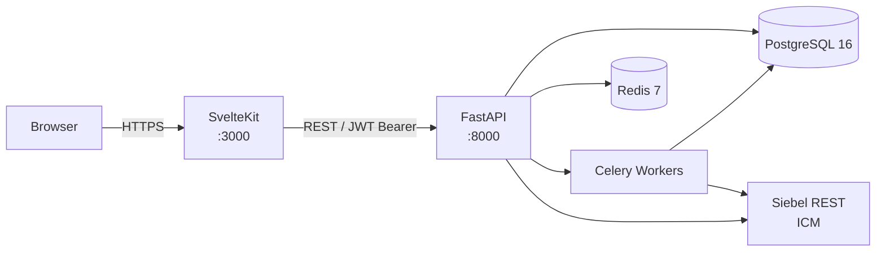

# Architecture Overview — MySS 2.0

This document covers the system's moving parts, how they connect, and the decisions behind the design. Read it once carefully — the patterns you see here repeat across every domain.

## High-Level Architecture Diagram



In production (OpenShift), SvelteKit runs server-side rendering behind a route-based ingress. The browser never calls FastAPI directly.

## The 10 Functional Domains

| # | Domain | Backend path | Frontend path | Siebel client |
|---|---|---|---|---|
| 1 | Registration & Onboarding | `app/domains/registration/` | `src/routes/registration/` | `app/services/icm/registration.py` |
| 2 | Service Requests (19 types) | `app/domains/service_requests/` | `src/routes/service-requests/` | `app/services/icm/service_requests.py` |
| 3 | Monthly Reports | `app/domains/monthly_reports/` | `src/routes/monthly-report/` | `app/services/icm/monthly_report.py` |
| 4 | Notifications & Messages | `app/domains/notifications/` | `src/routes/messages/` | `app/services/icm/notifications.py` |
| 5 | Payment Information | `app/domains/payment/` | `src/routes/payment-info/` | `app/services/icm/payment.py` |
| 6 | Employment Plans | `app/domains/employment_plans/` | `src/routes/employment-plans/` | `app/services/icm/employment_plans.py` |
| 7 | Account Info (+ PIN) | `app/domains/account/` | `src/routes/account/` | `app/services/icm/account.py` |
| 8 | Attachments & Documents | `app/domains/attachments/` | — | `app/services/icm/attachments.py` |
| 9 | Eligibility Estimator | `app/domains/eligibility/` | `eligibility-estimator/` (standalone) | None |
| 10 | Admin / Support View | admin role checks (all domains) | admin-specific routes | `app/services/icm/admin.py` |

Each domain has a corresponding FastAPI router registered in `app/main.py` and a Siebel client that extends `ICMClient`. Domain 9 (Eligibility Estimator) is the only one without a Siebel dependency — it uses local rules only.

## Request Lifecycle

Every protected page follows this path:

1. **Browser** — user navigates or submits a form.
2. **SvelteKit `+page.server.ts`** — runs server-side. Reads the Auth.js session cookie, extracts the JWT, and calls FastAPI with `Authorization: Bearer <token>`. SvelteKit contains **no business logic** — it is a presentation and data-loading layer only.
3. **FastAPI `get_current_user`** — decodes and validates the JWT (HS256, `JWT_SECRET`). Returns a `UserContext` with `user_id`, `role`, `bceid_guid`, and `idir_username`. Raises `401` if the token is missing or invalid.
4. **Domain service** — the router handler calls domain-specific service code, which may read/write PostgreSQL, check Redis cache, or call a Siebel client.
5. **Siebel REST (ICM)** — the appropriate `ICMClient` subclass handles OAuth2 token management, retries, and circuit breaking transparently.
6. **Response** — domain service returns a typed Pydantic model; FastAPI serialises it to JSON; SvelteKit receives it and passes it to the Svelte component as page data.

For async operations (e.g., attachment virus scanning, email sending), the domain service enqueues a Celery task rather than blocking the request.

## Authentication Flow

```
BCeID / BC Services Card / IDIR
          |
          v
       Keycloak (OIDC provider)
          |
          v
    Auth.js (@auth/sveltekit)
    — issues encrypted session cookie
    — mints JWT with sub, role, bceid_guid / idir_username
          |
          v
   SvelteKit +page.server.ts
   — reads session, forwards JWT to FastAPI
          |
          v
    FastAPI get_current_user()
    — validates JWT, returns UserContext
```

### UserRole

Defined in `app/auth/models.py`:

```python
class UserRole(str, Enum):
    CLIENT = "CLIENT"
    WORKER = "WORKER"
    ADMIN  = "ADMIN"
```

### UserContext

```python
class UserContext(BaseModel):
    user_id: str
    role: UserRole
    bceid_guid: str | None = None
    idir_username: str | None = None
```

`bceid_guid` is populated for CLIENT users; `idir_username` for WORKER and ADMIN users.

### require_role()

`require_role()` in `app/auth/dependencies.py` is a factory that returns a FastAPI dependency. ADMIN satisfies WORKER checks (ADMIN is a superset of WORKER):

```python
def require_role(required_role: UserRole):
    async def _require(user: UserContext = Depends(get_current_user)) -> UserContext:
        if user.role != required_role and not (
            required_role == UserRole.WORKER and user.role == UserRole.ADMIN
        ):
            raise HTTPException(status_code=403, ...)
        return user
    return _require
```

Use it as a route dependency: `Depends(require_role(UserRole.WORKER))`.

## Data Ownership Model

Data lives in exactly one place. Never duplicate Siebel data into PostgreSQL except as a short-lived cache.

| PostgreSQL owns | Siebel (ICM) owns |
|---|---|
| User accounts (Auth.js) | Cases |
| Local profiles (bceid_guid linkage) | Contacts / tombstone data |
| Registration sessions (draft state) | Service request processing |
| Audit logs | Payment schedules |
| Draft / in-progress form data | Cheque schedules |
| Attachment metadata (file references) | Employment plan records |
| Redis session cache (short-lived) | Monthly report records |

If you find yourself storing a case number's resolved data permanently in PostgreSQL, stop and reconsider — the source of truth is Siebel.

## Key Architectural Decisions

### FastAPI as the sole API layer

SvelteKit has no API routes that contain business logic. All data fetching and mutation flows through FastAPI. This keeps business logic testable in Python and prevents drift between server-rendered pages and any future mobile client.

### SvelteKit as a presentation-only layer

`+page.server.ts` files do three things: read the session, call FastAPI, pass data to the component. They do not validate business rules, call Siebel, or query the database directly. If you are tempted to add logic there, put it in FastAPI instead.

### Circuit breaker for Siebel

`ICMClient` wraps every outbound Siebel call with `_AsyncCircuitBreaker`. Default thresholds (from `app/services/icm/client.py`):

- **Failure threshold:** 5 consecutive failures → circuit opens
- **Recovery timeout:** 30 seconds → circuit moves to HALF_OPEN and allows one probe

When the circuit is open, callers receive `ICMServiceUnavailableError` immediately without waiting for a network timeout. This protects the API under Siebel degradation.

Retry policy (also in `ICMClient`): 3 attempts, exponential backoff 1–4 seconds, on 5xx and connection errors only. 4xx responses are never retried.

### Redis TTLs

All TTL constants are in `app/cache/keys.py`:

| Key | TTL | Rationale |
|---|---|---|
| `session:{user_id}` | 900 s (15 min) | Matches session timeout |
| `icm_cache:case:{case_number}` | 300 s (5 min) | Case status changes infrequently |
| `icm_cache:payment:{case_number}` | 3600 s (1 hr) | Payment details stable within pay period |
| `icm_cache:cheque_schedule:{case_number}` | 3600 s (1 hr) | Shared by D3 and D5 |
| `icm_cache:banners:{case_number}` | 300 s (5 min) | Banner notifications |
| `support_view:{worker_idir}` | 900 s (15 min) | Worker support-view session |
| `pin_reset:{profile_id}` | 3600 s (1 hr) | PIN reset rate limiting |

### Celery for async work

Long-running or side-effect-heavy operations (virus scanning attachments, sending emails, background sync) are offloaded to Celery workers backed by Redis as the broker. The HTTP request returns immediately with a task ID; the client polls or receives a push notification when the work completes.

### Feature flags

`app/services/feature_flags.py` provides environment-variable-driven flags:

```python
class FeatureFlagService:
    @staticmethod
    def t5_disabled() -> bool:
        return os.getenv("FEATURE_T5_DISABLED", "false").lower() == "true"
```

Check the flag in a router or service before executing a code path. Add new flags to `FeatureFlagService` — do not scatter `os.getenv()` calls across domain code.

### Structured logging

`main.py` configures structlog globally with ISO timestamps, log level, and JSON output:

```python
structlog.configure(
    processors=[
        structlog.processors.TimeStamper(fmt="iso"),
        structlog.stdlib.add_log_level,
        structlog.processors.JSONRenderer(),
    ],
    ...
)
```

Every module gets a logger with `logger = structlog.get_logger()`. Pass context as keyword arguments (`logger.info("event_name", case_number=..., user_id=...)`) so log aggregators can filter on structured fields. Never concatenate strings into log messages.

## OpenShift Deployment

Defined in `openshift/api-deployment.yaml`:

- **Replicas:** 2 (rolling update, `maxUnavailable: 0`, `maxSurge: 1` — zero-downtime deploys)
- **Init container:** runs `alembic upgrade head` before the API starts — migrations are automatic on deploy
- **Health probes:** `/health` endpoint, readiness after 5 s, liveness after 30 s
- **Resource limits:** 512 Mi memory, 500m CPU per pod
- **Config injection:** DB, Redis, ICM, mail secrets injected via `secretRef`; non-sensitive config via `configMapRef`

The web tier (`myss-web`) has a parallel deployment configuration.
